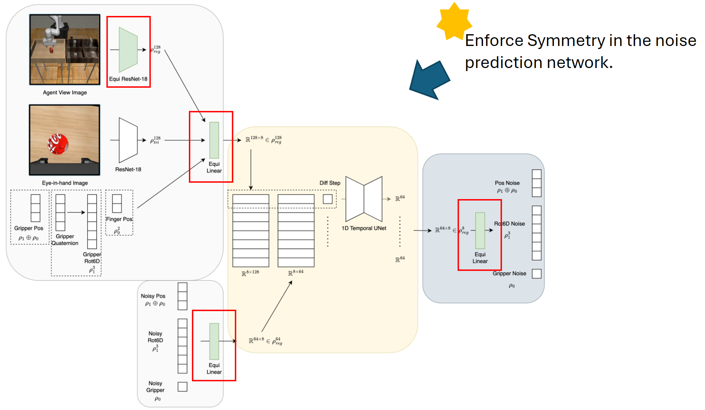
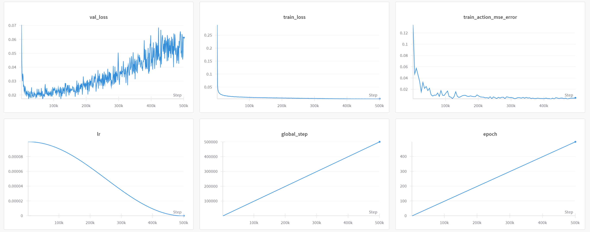

# Equivariant Diffusion Policy Reimplementation

This project is a reimplementation of **Equivariant Diffusion Policy** based on the work by Wang et al. (2024) [[Paper](https://arxiv.org/abs/2407.01812)].  
It focuses on leveraging SO(2) equivariance to improve the sample efficiency and generalization of diffusion models in robotic behavior cloning tasks.

## Project Highlights
- Reimplemented **Equivariant Encoder** and **Equivariant Diffusion U-Net**.
- Studied the theoretical foundation of SO(2)-equivariant diffusion models.
- Evaluated on the **Three-Piece Assembly D2** task from the MimicGen benchmark.
- Achieved stable convergence and task completion with voxel-based observations.

## Architecture

*Figure 1: Overall model architecture. Red components indicate the parts reimplemented in this project.*

## Training Curves

*Figure 2: Training curves. Loss decreases and stabilizes after around 50,000 steps, showing successful convergence.*

## Qualitative Results

| Step | Visualization | Description |
|:---:|:---:|:---|
| 1,000 steps |  | The agent struggles to initiate a grasp. |
| 30,000 steps |  | The agent can do the baby step. |
| 50,000 steps |  | The agent successfully completes the full assembly sequence. |

## Summary
The results demonstrate that integrating SO(2) symmetry through equivariant architectures significantly improves learning efficiency for robotic tasks with rotational symmetry.  
Future work may extend these methods to more complex tasks and settings with imperfect symmetries.

